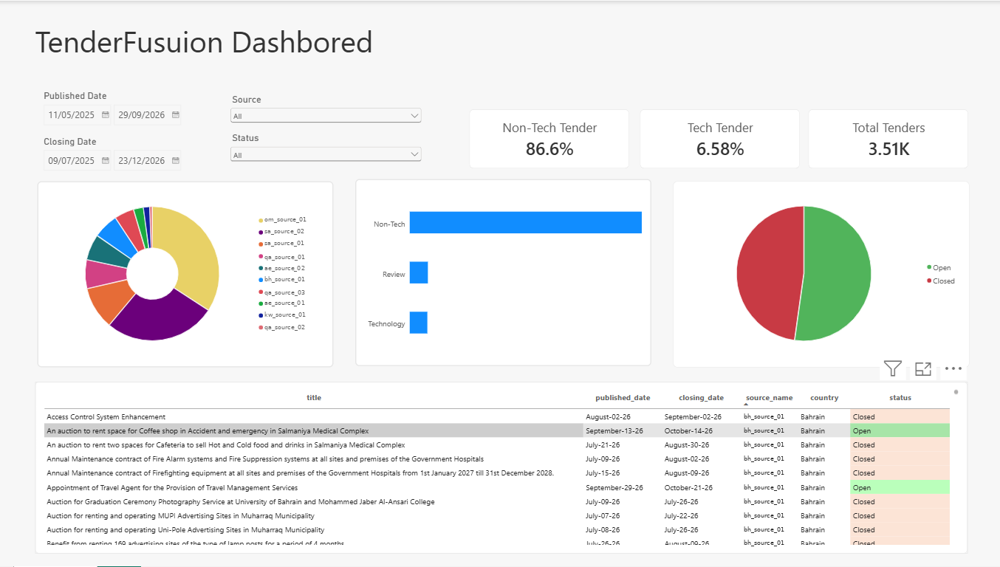

# TenderFusion: Data Engineering Capstone 2026

An end-to-end data pipeline that collects public tenders from **10 tender sources across six GCC countries** (government procurement portals and public tender listing sites). It stores them in a **Bronze → Silver → Gold** (medallion) lakehouse on Azure Blob Storage and publishes a clean, classified Gold table for a Power BI dashboard.

> **Source confidentiality (NDA).** The identities, URLs and endpoints of the data sources are covered by a non-disclosure agreement. They are **not** included in this repository. Every source is referred to by an anonymised alias (e.g. `sa_source_01`), and the real settings are supplied at runtime from a private, git-ignored configuration (see [Section 5](#5-api-keys-environment-variables-and-setup)).



*Power BI dashboard built on the Gold table.*

---

## 1. What the project does

| Layer | Code | What happens | Output |
|---|---|---|---|
| **Extract** | `02_src/main.py` + `02_src/extractors/` | Runs one scraper per portal (Playwright for JavaScript sites, `requests` for JSON APIs). They run in 4 parallel threads. Each scraper reads its previous JSON first, skips tenders it already has, and stops paging once a whole page is older than the target day. | `01_data/raw/<source>.json` |
| **Bronze** | `02_src/azure_upload.py` | Uploads each source's raw JSON unchanged to Azure Blob as `tenderbronze/<source>/<YYYY-MM-DD>/<run_timestamp>.json`. Unchanged files are skipped. | Azure `tenderbronze` container |
| **Silver** | `02_src/silver/silver.py` | Pure pandas, no Spark. It profiles the data (4V checks), classifies each tender as **Technology / Review / Non-Tech** using rule-based Arabic + English title evidence, and maps all 10 sources to one unified schema. It also converts values to SAR, cleans and parses dates, builds a stable `tender_id`, removes duplicates and runs quality gates. | Delta table + CSV (`tendersilver`) |
| **Gold** | `02_src/goldpip/gold.py` | Selects the dashboard columns and derives **Open / Closed** status from `closing_date` (Asia/Riyadh). | Delta table + CSV (`tendergold`), read by Power BI |

**Sources (10, anonymised):**

| Source alias | Country | Method | `tender_code` prefix |
|---|---|---|---|
| `sa_source_01` | Saudi Arabia | requests (JSON) | `SA1` |
| `sa_source_02` | Saudi Arabia | requests (API) | `SA2` |
| `om_source_01` | Oman | Playwright | `OM1` |
| `qa_source_01` | Qatar | Playwright | `QA1` |
| `qa_source_02` | Qatar | Playwright | `QA2` |
| `qa_source_03` | Qatar | Playwright | `QA3` |
| `ae_source_01` | UAE | Playwright | `AE1` |
| `ae_source_02` | UAE | Playwright | `AE2` |
| `bh_source_01` | Bahrain | Playwright | `BH1` |
| `kw_source_01` | Kuwait | Playwright | `KW1` |

The alias is used everywhere: extractor file name (`extractors/<alias>.py`), raw file (`<alias>.json`), Bronze folder (`tenderbronze/<alias>/...`) and the `source_name` column in Silver and Gold. The mapping from alias to real source is kept privately by the team and is not published.

The team runs extraction directly with **`main.py`** and runs Silver and Gold in **Databricks**, using Databricks Secrets for Azure access. Docker and the included GitHub Actions workflow are optional deployment alternatives. The workflow creates a manually triggered Azure Container Apps job; scheduling must be configured separately.

### Data storage and execution

The project datasets are stored in **Azure Storage Account (Azure Blob Storage)**. Databricks contains the processing code and runs the Silver and Gold stages against Azure storage. The workspace code folders and the storage containers serve different purposes.

```text
Azure Storage Account
├── tenderbronze/                 # Raw JSON collected from the tender sources
│   └── <source>/<YYYY-MM-DD>/<run_timestamp>.json
├── tendersilver/                 # Cleaned, standardized and classified data
│   ├── delta/silver_tenders/
│   └── tenders/silver_tenders.csv
└── tendergold/                   # Curated data for the Power BI dashboard
    ├── delta/gold_tenders/
    └── tenders/gold_tenders.csv
```

These are the default container names and output paths documented for this project; environment variables can override the container names. Dataset exports in the submission package are review copies, not the storage used by the running Silver and Gold stages.

### Submission package structure

The following tree describes the supplied `02_code` package. It is not a verified listing of the Databricks workspace. Databricks notebook and job paths should match the locations in the actual workspace.

```
02_code/
├── 01_data/                 # Azure dataset exports for submission, if included; local extraction staging
├── 02_src/
│   ├── main.py               # Extraction entry point (runs every extractor, then uploads to Bronze)
│   ├── azure_upload.py       # Bronze restore / upload helpers
│   ├── run_local_pipeline.py # Runs the Azure pipeline from a local terminal
│   ├── extractors/           # One scraper per source alias + shared helpers (_browser_fallback, _date_utils, _paths, _sources_config)
│   ├── config/sources.example.json  # Template for the private source config (real file is git-ignored)
│   ├── silver/silver.py      # Silver layer
│   ├── goldpip/gold.py       # Gold layer
│   ├── tests/                # Unit tests (browser fallback logic, no internet needed)
│   ├── setup_secrets.py      # One-time: stores the Azure connection string in a Databricks secret scope
│   ├── install_deps.sh       # Databricks cluster init script (installs Playwright + browsers)
│   ├── Dockerfile, docker-compose.yml, Dockerfile.dockerignore
│   ├── .github/workflows/deploy.yml   # CI/CD to Azure Container Apps (copy of the repo workflow)
│   └── .env.example          # Common environment settings and examples
├── 03_assets/               # Power BI dashboard assets (powerbi_dashboard.png)
├── requirements.txt
└── README.md
```

---

## 2. Required software and packages

- **Python 3.10 – 3.12** (tested with 3.11)
- **pip** and (recommended) `venv`
- **Playwright browsers** (Chromium, Firefox, WebKit). They are installed by one command below.
- Python packages, listed in `requirements.txt`:

| Package | Used for |
|---|---|
| `requests`, `beautifulsoup4` | API/HTML scraping (`sa_source_01`, `sa_source_02`) |
| `playwright==1.62.0` | Browser-based scraping |
| `azure-storage-blob` | Reading/writing the Bronze, Silver, Gold containers |
| `pandas`, `numpy` | Silver & Gold transformations |
| `pyarrow`, `deltalake` | Writing Delta tables without Spark (delta-rs) |
| `databricks-sdk` | *(optional)* `setup_secrets.py` only |

An **Azure Storage account** and credentials are required for the complete pipeline. **Databricks** is used for the team’s cloud execution. **Docker** is optional. Power BI provides the dashboard visuals; the screenshot shown above is stored in `03_assets/powerbi_dashboard.png`.

---

## 3. Install dependencies

Run from the `02_code` folder:

```bash
# 1) create and activate a virtual environment
python3 -m venv .venv
source .venv/bin/activate          # Windows: .venv\Scripts\activate

# 2) install the Python packages
python -m pip install -r requirements.txt

# 3) install the browsers Playwright drives
python -m playwright install chromium firefox webkit
#    Linux servers without a desktop also need the system libraries:
#    python -m playwright install --with-deps chromium firefox webkit

# 4) add the private source config (team members only, provided under NDA)
cp config/sources.example.json config/sources.local.json
#    then fill in the real values -- this file is git-ignored, never commit it
```

---

## 4. How to run the project

After installing dependencies, activate your virtual environment and move from `02_code` into `02_src` once:

```bash
source .venv/bin/activate
cd 02_src
```

Run the commands below from `02_src`. On macOS, use `python3` if `python` is unavailable. Do not repeat `cd 02_src` if you are already there.

### A. First run: collect fresh data and run all stages

For a fresh run, including when `01_data/raw/` is empty, configure Azure access in your terminal and run:

```bash
export AZURE_STORAGE_CONNECTION_STRING="<your Azure Storage connection string>"
python3 run_local_pipeline.py --extract
```

This runs `main.py` to collect live data and upload it to **Azure Bronze**, then runs **Silver → Gold against Azure**. Internet access, Playwright browsers, and Azure permissions are required. Databricks Secrets are not automatically available in a local terminal.

Existing raw records may be reused, and new tenders are appended according to each extractor’s rules. This is not a forced full historical download.

### B. Reprocess existing Azure Bronze data

```bash
python3 run_local_pipeline.py
```

Without `--extract`, the runner skips live extraction and reads **existing Bronze data from Azure**. It does not read local raw or Bronze files. Despite its retained name, `run_local_pipeline.py` runs the Azure workflow from your computer; it is not an offline pipeline.

| Layer | Azure container (default) | Output paths |
|---|---|---|
| Silver | `tendersilver` | `delta/silver_tenders/` and `tenders/silver_tenders.csv` |
| Gold | `tendergold` | `delta/gold_tenders/` and `tenders/gold_tenders.csv` |

`01_data/` can contain dataset copies exported from Azure Storage for submission, while extraction uses `01_data/raw/` as its default local staging path before uploading raw JSON. The authoritative pipeline datasets are stored in Azure Storage Account. Silver and Gold read from Azure; this runner does not automatically download their outputs into `01_data/`. Any submission copies and their row counts depend on the selected Azure export.

### C. Direct Python run (the team’s usual method)

The team runs extraction directly with `python main.py`; Docker is not required. With Azure credentials configured, this command scrapes the sources and uploads raw data to Bronze. Silver and Gold run separately, either with the commands below or as Databricks jobs.

```bash
export AZURE_STORAGE_CONNECTION_STRING="DefaultEndpointsProtocol=https;AccountName=...;AccountKey=...;EndpointSuffix=core.windows.net"
python main.py                  # scrape + upload to tenderbronze
python silver/silver.py     # Bronze → tendersilver (Delta + CSV)
python goldpip/gold.py          # tendersilver → tendergold (Delta + CSV)
```

In Databricks, `silver.py` and `gold.py` run as notebooks. They read the connection string from the secret scope `azure-storage` / key `connection-string` (create it once with `python setup_secrets.py`).

### D. Optional: run extraction with Docker

Docker is an alternative to running `python main.py` directly. It is not required for the direct Python workflow or the full-pipeline runner. The container runs `main.py` for extraction and optional Bronze upload; Silver and Gold still run separately.

From `02_code/02_src` (the same directory used above):

```bash
docker compose up --build       # writes raw JSON into 02_code/01_data/raw
```

### E. Tests

```bash
python -m unittest discover -s tests -v   # 6 tests, run offline (use a dummy source config, no real URLs needed)
```

---

## 5. API keys, environment variables and setup

**No API keys are needed to scrape.** The configured sources provide public tender listings. However, the **source URLs and endpoints are confidential (NDA)** and must be supplied through the private source config described below; without it, each extractor stops with a clear `Missing private setting ...` message and `main.py` continues with the others. Azure credentials are required for the complete pipeline. Running `main.py` alone without credentials skips uploading; Silver still requires Azure Bronze access. See `02_src/.env.example` for common settings. Python scripts read exported environment variables and do not automatically load a `.env` file; Docker Compose reads `.env` from `02_src` for values referenced in `docker-compose.yml`.

| Variable | Needed for | Default |
|---|---|---|
| `TENDER_SOURCES_CONFIG` | Path to the private source config (NDA) | `config/sources.local.json` |
| `TENDER_SOURCES_JSON` | The whole private source config as one JSON string (CI, Docker, cloud jobs). Takes priority over the file | unset |
| `<ALIAS>_<KEY>` | Override one private setting, e.g. `SA_SOURCE_01_API_URL`. Highest priority | unset |
| `AZURE_STORAGE_CONNECTION_STRING` | Upload to / read from Azure. Must contain `AccountName` and `AccountKey` (delta-rs needs them). | unset → extraction upload skipped; direct cloud Silver/Gold runs require credentials |
| `BLOB_CONTAINER_NAME` | Bronze container `main.py` uploads to | `tenderbronze` |
| `BRONZE_CONTAINER` / `SILVER_CONTAINER` / `GOLD_CONTAINER` | Container names for Silver/Gold | `tenderbronze` / `tendersilver` / `tendergold` |
| `HEADLESS` | `1` hides the browser window for the `bh_source_01` scraper (set it on servers) | `0` locally, `1` on Databricks |
| `TENDER_DATA_DIR` | Change where raw JSON is stored | `02_code/01_data` |
| `SILVER_MODE` | `rebuild` (all Bronze history), `incremental` (new blobs only), `auto` | `rebuild` |
| `SILVER_DRY_RUN` | Run Silver directly without writing outputs or running its final cleanup; the full-pipeline runner rejects this mode | `false` |
| `SILVER_LOCAL_MODE` | Optional local Silver output; Bronze is still read from Azure. The full-pipeline runner disables local output | `false` |
| `RESTORE_RAW_FROM_BRONZE` | Cloud job: restore the last Bronze copy before scraping (`auto`/`always`/`never`) | `auto` |
| `GOLD_TIMEZONE`, `GOLD_AS_OF_DATE` | Date used for Open/Closed status | `Asia/Riyadh`, today |

**Private source config (NDA):** copy `config/sources.example.json` to `config/sources.local.json` and fill in the real values supplied to the team. The file is listed in `.gitignore` and `.dockerignore`. Settings are resolved in this order: `<ALIAS>_<KEY>` environment variable → `TENDER_SOURCES_JSON` → the file at `TENDER_SOURCES_CONFIG`. Docker Compose mounts the file read-only instead of copying it into the image; the GitHub Actions workflow expects it as the repository secret `TENDER_SOURCES_JSON`.

**Databricks setup:** store the Azure connection string in scope `azure-storage`, key `connection-string`, and the private source config JSON in scope `tender-sources`, key `config` (`main.py` and Silver read it automatically). `setup_secrets.py` requires authenticated Databricks SDK access. GitHub Secrets are not needed for this direct Databricks workflow. When running stages separately, keep `BLOB_CONTAINER_NAME` and `BRONZE_CONTAINER` aligned.

Never commit a real `.env` file, connection string or `config/sources.local.json`. All three are already listed in `.gitignore`.

---

## 6. Limitations and known issues

- **Azure is required.** This version of Silver no longer reads local Bronze files. Existing Databricks job paths must refer to `silver.py`.
- **Delta cleanup:** Silver removes obsolete Delta data files immediately during normal runs; final cleanup is skipped during `SILVER_DRY_RUN`. Previous versions and concurrent readers may depend on those files. Cleanup does not guarantee one active Parquet file. Keep `_delta_log`, which is required for Delta tables.
- **Output schema:** `tender_type` is omitted from Silver output; the supplied Gold code does not require it.
- **Scrapers depend on the portals' HTML/APIs.** If a site changes its layout, adds a CAPTCHA or goes down, that extractor fails. `main.py` then marks it `WARNING: ... extraction failed`, and continues with the other sources. Check the extraction summary: `main.py` can finish with exit code 0 even when individual extractors fail, so exit code alone does not confirm fresh data from every source.
- **Rate limits and access limits.** `sa_source_01` returns HTTP 429 if pages are requested too fast (a 3-second delay is built in). `qa_source_03` and `ae_source_02` show guests only the first ~100 results.
- **`bh_source_01` opens a visible browser locally** by default. Set `HEADLESS=1` on servers or in Docker.
- **Classification is rule-based** (keyword evidence in Arabic and English, no ML). Ambiguous titles are sent to `Review` instead of being guessed. The proportion marked `Review` depends on the exported dataset.
- **Currency conversion uses fixed FX rates** (dated 2026-09-21, hard-coded in Silver). They are not live rates.
- **Missing closing dates count as Open** in Gold (team decision). Some sources don't publish a closing date.
- **Silver needs history for all 10 sources** in Bronze on a rebuild. It stops with an error if a source has never been uploaded.
- **Source names are anonymised.** Extractor files, raw files, Bronze folders, `source_name` and the `tender_code` prefixes all use the aliases above. Bronze data collected before the rename must be migrated to the new folder names (team-internal script) and Silver rebuilt with `SILVER_MODE=rebuild`; `tender_id` / `tender_code` values change once after that rebuild.
- **Confidentiality of outputs.** The repository contains no source identities, but the Silver/Gold data in Azure still holds each tender's original `source_url`. Do not publish exports or dashboard screenshots that show those links.
- `deploy.yml` builds from the GitHub repository, where the code sits at the repo root. The local `Dockerfile` in this folder is adapted to the `02_code` layout.
